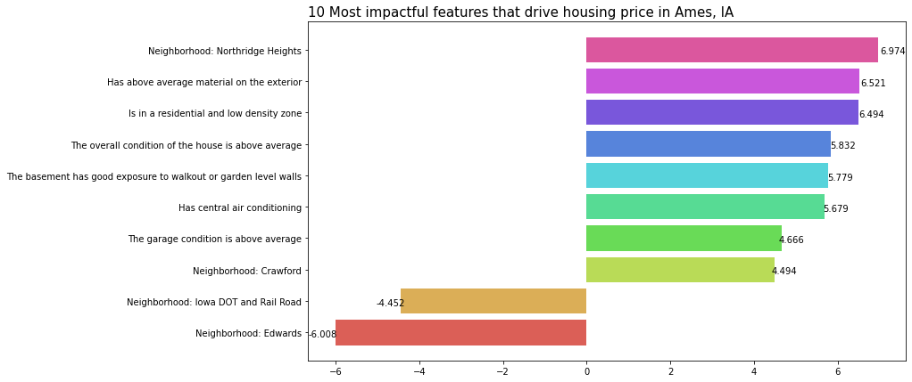
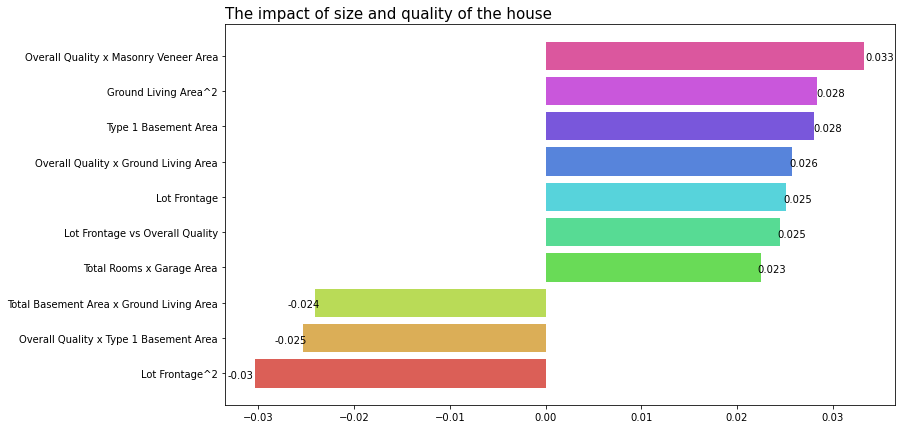

# Ames Housing Data

## Problem Statement

What can we learn from house sales in Ames, IA between 2005-2010? What affects housing price? How much does each feature affect the price? As a seller, what can you do to maximize profit?

## Dataset

This dataset comes from the Housing Data Set from Ames, IA. The detailed data documentation may be found [here](http://jse.amstat.org/v19n3/decock/DataDocumentation.txt).

The data dictionary of the variables used in the study may be found below.

### Data Dictionary

|Feature   |Type     |Description|
|:---------|:--------|:---|
|MS SubClass|*categorical* |Identifies the type of dwelling involved in the sale.|
|MS Zoning |*categorical* |Identifies the general zoning classification of the sale.|
|Lot Frontage|*continuous* |Linear feet of street connected to property|
|Lot Shape  |*categorical* |General shape of property|
|Land Contour    |*categorical* |Flatness of the property|
|Lot Config|*categorical*|Lot configuration|
|Neighborhood|*categorical*|Physical locations within Ames city limits|
|Condition 1 | *categorical* |Proximity to various conditions|
|Condition 2| *categorical* |Proximity to various conditions (if more than one is present)|
|Bldg Type| *categorical* |Type of dwelling|
|Overall Qual | *categorical* |Rates the overall material and finish of the house|
|Overall Cond   |*categorical*|Rates the overall condition of the house|
|Year Built|	*categorical*	|Original construction date|
|Roof Style|	*categorical*	|Type of roof|
|Mas Vnr Type|	*categorical*	|Masonry veneer type|
|Mas Vnr Area|*continuous*|Masonry veneer area in square feet|
|Exter Qual      |*categorical* |Evaluates the quality of the material on the exterior |
|Exter Cond  |*categorical* |Evaluates the present condition of the material on the exterior|
|Foundation    |*categorical* |Type of foundation|
|Bsmt Qual  |*categorical* |Evaluates the height of the basement|
|Bsmt Cond    |*categorical* |Evaluates the general condition of the basement|
|Bsmt Exposure|*categorical*|Refers to walkout or garden level walls|
|BsmtFin Type 1|*categorical*|Rating of basement finished area|
|BsmtFin SF 1 | *continuous* |Type 1 finished square feet|
|Total Bsmt SF| *continuous* |Total square feet of basement area|
|Heating| *categorical* |Type of heating|
|Heating QC | *categorical* |Heating quality and condition|
|Central Air  |*categorical*|Central air conditioning|
|Electrical|	*categorical*	|Electrical system|
|2nd Flr SF|	*continuous*	|Second floor square feet|
|Gr Liv Area|	*continuous*	|Above grade (ground) living area square feet|
|Bsmt Full Bath|*discrete*|Basement full bathrooms|
|Bsmt Half Bath     |*discrete* |Basement half bathrooms|
|Full Bath |*discrete* |Full bathrooms above grade|
|Half Bath   |*discrete* |Half baths above grade|
|Bedroom AbvGr |*discrete* |Bedrooms above grade (does NOT include basement bedrooms)|
|Kitchen AbvGr  |*discrete* |Kitchens above grade|
|Kitchen Qual|*discrete*|Kitchen quality|
|TotRms AbvGrd|*discrete*|Total rooms above grade (does not include bathrooms)|
|Functional | *categorical* |Home functionality (Assume typical unless deductions are warranted)|
|Fireplace Qu| *categorical* |Fireplace quality|
|Garage Type| *categorical* |Garage location|
|Garage Finish | *categorical* |Interior finish of the garage|
|Garage Area |*continuous*|Size of garage in square feet|
|Garage Qual|	*categorical*	|Garage quality|
|Garage Cond|	*categorical*	|Garage condition|
|Paved Drive|	*categorical*	|Paved driveway|
|Open Porch SF|*continuous*|Open porch area in square feet|
|Mo Sold|	*discrete*	|Month Sold (MM)|
|Yr Sold|	*discrete*	|Year Sold (YYYY)|
|Sale Type|	*categorical*	| Type of sale|
|SalePrice|*continuous*|Sale price $$|

## Main findings

I used Linear Regression model for this study. I modeled it without penalty, with L1 penalty (LASSO regularization) and with L2 penalty (Ridge regularization). The best model was the one with L2 penalty.

- Most of the categorical features could be converted into binary features. Some examples include, 
  - The level of the interior finish of the garage was not important. Whether the garage was finished was important.
  - The height range of the basement was not important; whether it was over a minimum height was important.
  - The condition of the basement was not important; whether it was at least good was important
  - The general zoning classification was not important; whether the house was in a low density residential zone or not was important
  
- The 10 most impactful features are:

- 10 most impactful numeric features are:

- Neighborhood is important. Some houses by virtue of being in a certain neighborhood, have a high price (e.g. Northridge Heights) and some have low price (e.g. Edwards). For example, a house in Northridge Heights has almost 7% higher sale price than houses in other neighborhoods, holding all else constant.

- In most cases, larger houses and good quality houses have higher price. However, these features have a maximal point where beyond that point the size of the house begin to negatively affect the price of the house. For example, 
  - For each percentage increase in lot frontage, we expect the price of the house to increase in 0.025%, holding all else constant. However, there's a limit to this phenomenon as too large lot frontage actually negatively affects house price. 
  - For each percentage increase in type 1 basement area, we expect the sale price to increase by 0.028%, holding all else constant. However, rather curiously, for each percentage increase in the overall material and finish of the house along with type 1 basement area, we actually expect the sale price to decrease by 0.025%.

## Conclusion

- If it is a feature that is a categorical grade (Excellent, Good, Average etc.) and it costs to get a high grade, it suffices to have Average grade. For example, it suffices to have an above average quality material on the exterior.
- Neighborhood is important. As a prospective seller, it's always better to target houses in certain neighborhood over others to sell later on.
- Larger houses sell for more. However, to mindful about basement area because larger house with a large basement actually sells for less. 
- Large lot frontage area is good but too large lot frontage area is bad.
- As overall quality and masonry veneer or overall quality and above ground area increase, we expect the sale price to increase, holding all else constant. However, same cannot be said about overall quality and basement area.